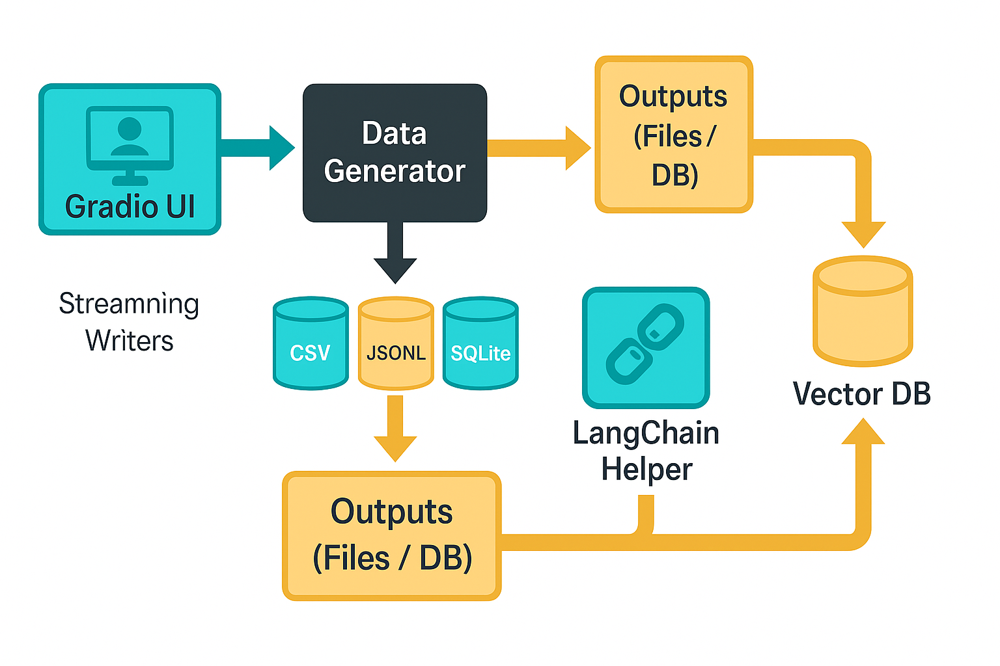

# Synthetic Data Generator

Configurable, LLM-powered synthetic dataset generator with a Gradio UI.
Create realistic enterprise-style datasets — companies → employees → products → reviews/specs — enriched by LLMs, streamed to disk, logged live in the UI, and ready for LangChain / RAG experiments.



## Overview

The Synthetic Data Generator provides safe, scalable, and configurable datasets for development, testing, and ML workflows.

It combines:

- Faker for realistic structure (names, addresses, jobs, etc.).
- LLM enrichment for natural-sounding blurbs, bios, product specs, reviews, and gold-label categories.
- Streaming exports to handle very large datasets without exhausting memory.
- Noise injection (optional) for robustness testing.
- LangChain helper pattern for quick ingestion into vector stores for RAG pipelines.
## Capabilities

### Generate hierarchical enterprise data:

- Companies: industry, sub-industry, country, size, revenue, incorporation date, about-us.
- Employees: ID, name, email, department, salary, hire date, bio.
- Products: name, category, price, launch date, features, specs, reviews, gold label.

### Configurable UI controls:

- Industry & sub-industry selectors.
- Regions & countries.
- Company sizes (small/medium/large) with per-size employee count inputs.
- Products per company (default = 3; configurable 100–10,000).
- Noise injection toggle.

### Multiple output formats:

- CSV (companies.csv, employees.csv, products.csv).
- JSONL (line-delimited JSON + combined summary file).
- SQLite (relational DB with batched inserts).

### Live feedback:

- Progress bar.
- Live-appending textual log (shows messages as generation runs).
- Preview tables (first 10 rows per entity).
## Use Cases

- Populate dev/test environments with realistic but safe synthetic data.
- Benchmark ETL, ingestion, deduplication, and validation pipelines.
- Test DB scaling with streamed relational inserts (SQLite).
- Train and evaluate ML models with LLM-enriched corpora.
- Create noisy corpora to test data-cleaning & preprocessing.
## RAG / LangChain Integration

The generator is LangChain-ready:

- Export to JSONL → convert each product/company into Document objects.
- Embed with OpenAI, Cohere, or local models.
- Upsert into FAISS / Chroma / Pinecone / Milvus.
- Use retrievers in LangChain to ground LLM answers on synthetic corpora.

### Helper pattern (example)

```bash
from langchain.schema import Document
import json

def convert_jsonl_to_documents(path):
    docs = []
    with open(path, "r", encoding="utf-8") as f:
        for line in f:
            row = json.loads(line)
            content = row.get("marketing_blurb","") + " " + ", ".join(row.get("features",[]))
            metadata = {"product_id": row["product_id"], "company_id": row["company_id"], "gold_label": row["gold_label"]}
            docs.append(Document(page_content=content, metadata=metadata))
    return docs

```

## Implementation Steps

1. Clone & setup environment
```bash
git clone <repo-url>
cd SyntheticDataGen
python -m venv .venv
source .venv/bin/activate   # or .\.venv\Scripts\activate
pip install -r requirements.txt

```
2. Enable LLM enrichment in ".env" file
```bash
export OPENAI_API_KEY="sk-..."

```
3. Runn the App
```bash
python main.py

```
4. Configure via the UI
- Choose industries, sub-industries, regions, sizes.
- Set employee/product counts.
- Select output format & streaming.
- Click Generate → preview and download outputs.
## Current Fixes and Known Issues

1. Faker locale errors (e.g. en_SG) → fixed with safe fallback to en_US.
2. Gradio compatibility → removed _js kwarg, replaced gr.CheckboxGroup.update() with gr.update().
3. Long runs hanging → fixed with streaming writes (CSV/JSONL/SQLite).
4. Memory pressure → capped employees/products per company (MAX_EMPLOYEES_SAFE, MAX_PRODUCTS_SAFE).
5. SQLite live preview may occasionally hit DB-lock errors while writing → retry logic in place, but previews can appear empty mid-run.
## Future Enhancement

1. Live-updating preview tables (rows appear as written).
2. Resume & checkpointing for large jobs.
3. Parallel generation for faster throughput.
4. Direct S3/GCS sinks.
5. Parquet/Feather exports for analytics pipelines.
6. CLI + config-driven runs.
7. Prebuilt LangChain connector CLI (generate → embed → upsert)
## Contributing / Troubleshooting

- Upgrade Gradio UI if UI error appears 
```bash
pip install --upgrade gradio
```
- Upgrade Faker for locale Coverage
```bash
pip install --upgrade Faker
```
## License

[MIT](https://choosealicense.com/licenses/mit/)

### Acknowledgments

    OpenAI for providing the API 
    Gradio for the intuitive web interface framework

### Related Reading

    OpenAI API Documentation

⭐ If this tool helped you generate useful Synthetic Data for your usecases, please star the repository!

Built with ❤️ for the AI community
